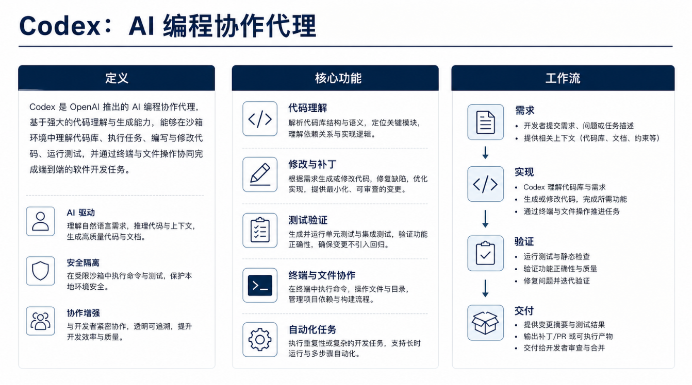
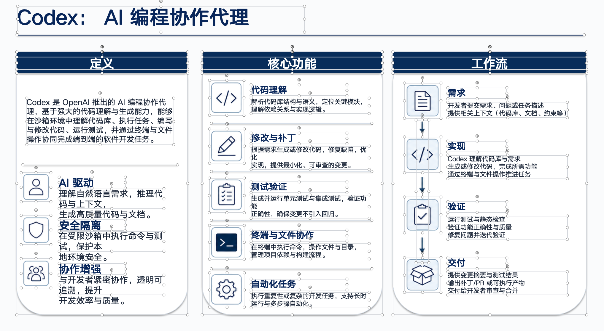
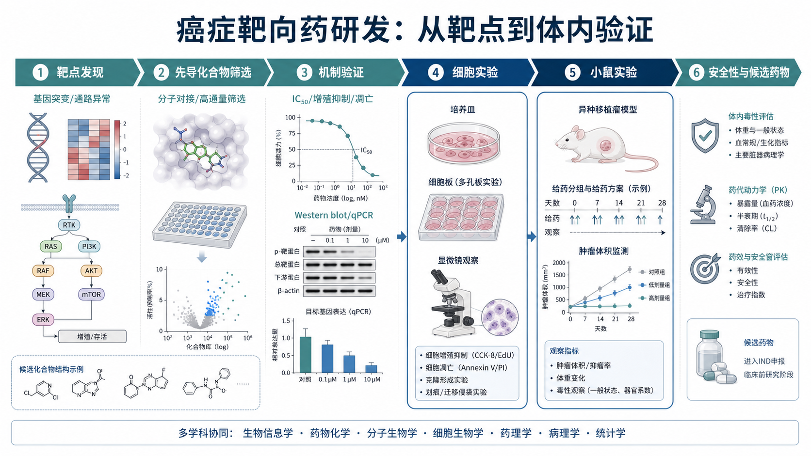
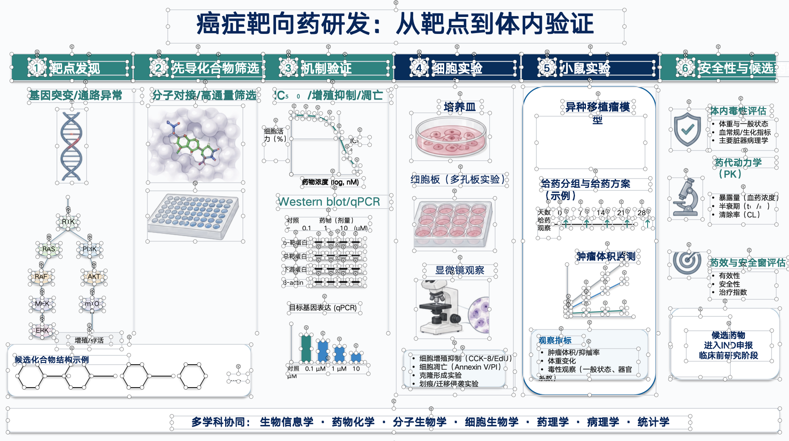
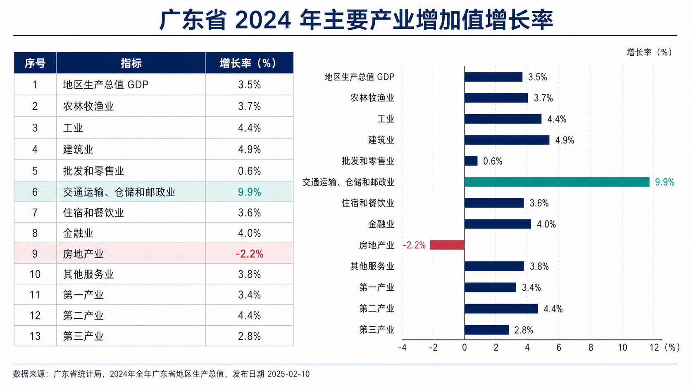
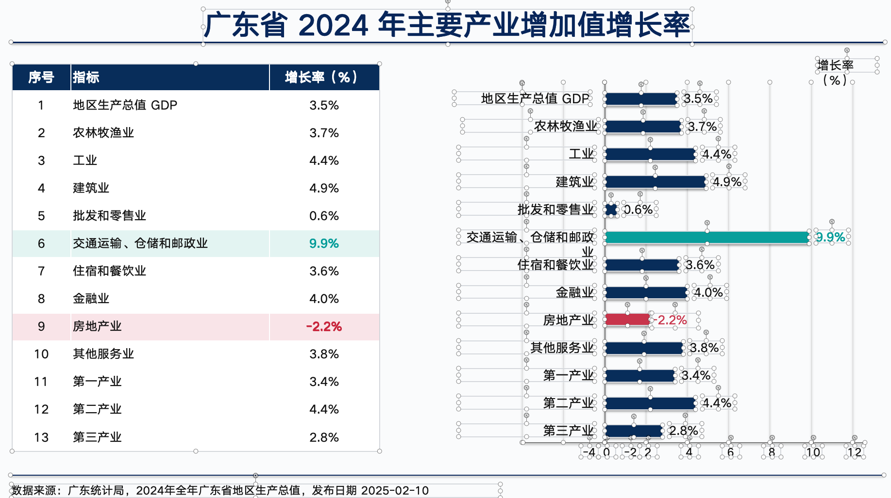

# image-to-pptx

[](https://github.com/renzhidong8-prog/image-to-pptx/stargazers) [](https://github.com/renzhidong8-prog/image-to-pptx/forks)

一个面向 Codex 的幻灯片图片转可编辑 PowerPoint 的 precision rebuild skill。

它会把页面中的非文字视觉元素拆分为独立透明 PNG，将可读文字重新创建为可编辑文本框，并优先把表格还原为 PowerPoint 原生表格。重建完成后，还会检查裁剪完整性、文字残留、文本溢出、元素位置和字号，尽量得到便于二次修改的 `.pptx` 文件。

> [!TIP]
> 本 skill 面向已有幻灯片图片的可编辑重建，不负责从文章、报告或大纲直接生成全新 PPT。

## 转换效果示例

<table>
  <tr>
    <th>原图</th>
    <th>转换后可编辑效果</th>
  </tr>
  <tr>
    <td></td>
    <td></td>
  </tr>
  <tr>
    <td></td>
    <td></td>
  </tr>
  <tr>
    <td></td>
    <td></td>
  </tr>
</table>

## 特点

- 将每页中的非文字视觉元素拆分为独立 PNG，保留透明背景、原始比例、相对位置和层级。
- 对裁剪区域保留安全边距，避免图标、箭头、边框、阴影、实验图和图表被切断。
- 从 PNG 中剔除可读文字，再使用独立可编辑文本框进行还原。
- 最终文字统一使用 `微软雅黑` / `Microsoft YaHei`。
- 识别到清晰行列结构时，优先输出 PowerPoint 原生表格，而不是把表格保留成图片。
- 简单线条、矩形、圆角框、分隔线和箭头优先使用 PowerPoint 原生形状。
- 输出前执行 QA：检查文字残留、漏识别、裁剪缺失、文本超框、遮挡和元素跑位。
- 附带 `scripts/native_table_pptx.py`，可根据 JSON 规格生成原生 PowerPoint 表格。

## 输入与输出

输入通常是一张或多张幻灯片页面图片，输出包括：

| 输出内容 | 说明 |
| --- | --- |
| 可编辑 `.pptx` | 按照原始页面布局重建的 PowerPoint 文件 |
| 拆分 PNG 资产 | 非文字视觉元素，透明背景，独立输出 |
| 资产映射清单 | 记录 PNG、文本框、表格与页面位置的对应关系 |
| QA 备注 | 说明仍需人工复核的极小标签或复杂图内文字 |

## 适用场景

- 把幻灯片截图转换为可以修改文字和调整布局的 PPTX。
- 把图片版 PPT 页面拆解为独立视觉素材和可编辑文本框。
- 对实验流程图、信息图、数据页和表格页进行高保真重建。
- 把页面中的表格还原为可以直接修改单元格内容的 PowerPoint 原生表格。
- 检查源图和输出结果之间的缺字、错位、裁剪不完整或字号异常。

## 运行要求

- Codex
- Python 3
- 如需使用原生表格辅助脚本，请安装 [`python-pptx`](https://python-pptx.readthedocs.io/)

```bash
pip install python-pptx
```

## 安装

推荐使用 `skills` CLI 安装到 Codex 的全局 skills 目录：

```bash
npx -y skills@latest add renzhidong8-prog/image-to-pptx \
  --skill image-to-pptx \
  --agent codex \
  --global
```

也可以直接在 Codex 对话里输入：

```text
$skill-installer https://github.com/renzhidong8-prog/image-to-pptx
```

安装完成后，重启 Codex 让新 skill 生效。

## 使用方式

在 Codex 里可以用 `$image-to-pptx` 显式选中这个技能。图片可以直接粘贴、附加到对话框，或提供本地路径：

```text
$image-to-pptx 把这张幻灯片图片转成可编辑 PPTX。
$image-to-pptx 把这些页面图片按顺序重建成一个可编辑 PPTX。
$image-to-pptx 把 /path/to/slides/ 目录中的页面图片转成可编辑 PPTX。
```

skill 通常会完成这些步骤：

1. 识别页面中的文字、表格、图标、插图、图表、背景、框图、箭头和分隔线。
2. 拆分非文字视觉元素，生成独立透明 PNG。
3. 从视觉资产中移除可读文字，并重建为可编辑文本框。
4. 将识别出的表格还原为 PowerPoint 原生表格。
5. 按原始页面位置放回 PNG、文本框、表格和原生形状。
6. 检查裁剪、文字残留、文本溢出、遮挡、字号和位置，修正后导出 `.pptx`。

## 原生表格辅助脚本

`scripts/native_table_pptx.py` 可以根据 JSON 规格生成包含原生 PowerPoint 表格的单页 PPTX：

```bash
python scripts/native_table_pptx.py \
  --spec table.json \
  --out table-slide.pptx
```

JSON 示例：

```json
{
  "slide_size": [13.333, 7.5],
  "table_box": [0.5, 1.2, 6.0, 4.8],
  "headers": ["序号", "指标", "增长率（%）"],
  "rows": [["1", "地区生产总值 GDP", "3.5%"]],
  "font": "Microsoft YaHei",
  "header_fill": "082D5A",
  "header_font_color": "FFFFFF",
  "body_font_color": "111111"
}
```

## 边界

- 本 skill 面向已有页面图片的可编辑重建，不是从零生成整套 PPT 内容。
- 对照片、插画、纹理和复杂实验图，通常会保留为独立 PNG 资产，不能保证图片内部对象全部可编辑。
- 对复杂图表内无法可靠识别的极小标签，可能需要保留为图片或人工复核。
- 页面重建会尽量接近原图，但不保证每个像素完全一致。
- 最终判断应同时关注视觉相似度、文本可编辑性、表格可编辑性和资产裁剪完整性。

## 仓库结构

```text
.
├── SKILL.md                         # skill 入口说明和执行规则
├── agents/
│   └── openai.yaml                  # Codex UI 展示名称和默认调用提示
├── prompts/
│   └── precision-rebuild.md         # 精确重建主提示词
├── scripts/
│   └── native_table_pptx.py         # 原生 PowerPoint 表格辅助脚本
└── .gitignore
```

## Star History

[](https://www.star-history.com/#renzhidong8-prog/image-to-pptx&Date)

## 交流群

扫描二维码加入交流群，分享使用经验、反馈问题，并获取更新通知。


## 许可证

本仓库当前未附加开源许可证。
